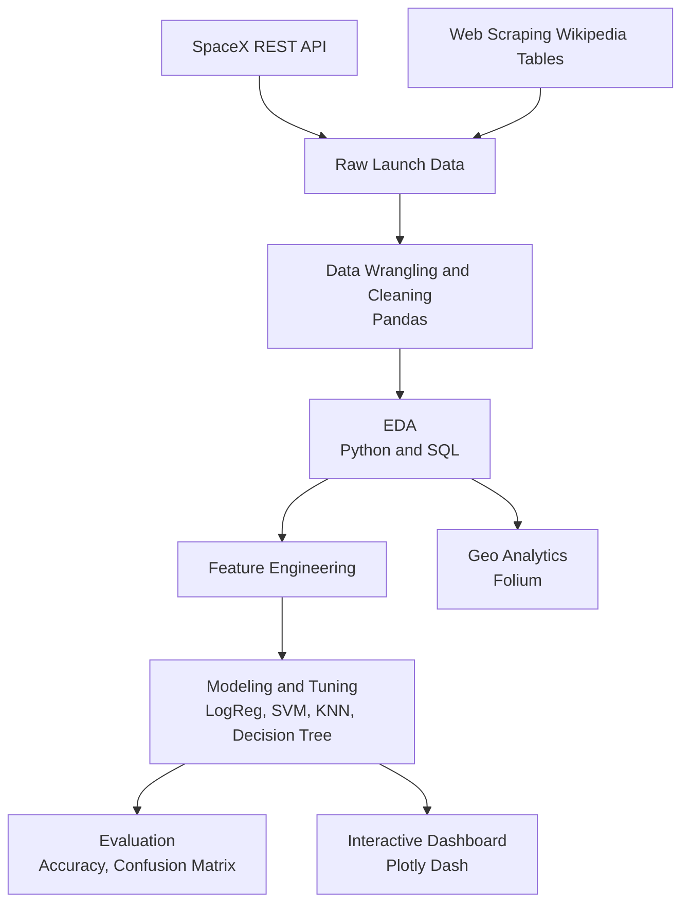

# 🚀 SpaceX Falcon 9 Landing Prediction — End-to-End ML & Data Science Capstone
**IBM Data Science Professional Certificate | Capstone Project**

<p align="center">
  
</p>

<p align="center">
  <a href="https://github.com/adhishnanda/IBM-Data-Science-SpaceX-Capstone-Project"></a>
  
  
  
  
</p>

<p align="center">
  <b>Goal:</b> Predict whether SpaceX Falcon 9 first-stage landing will be successful using historical launch data + engineered features.<br/>
  <b>Deliverables:</b> Reproducible notebooks, ML models w/ tuning, interactive dashboard, and geo-analytics (Folium).
</p>

A complete **end-to-end data science capstone** (IBM Data Science Professional Certificate / Applied Data Science Capstone) using real SpaceX Falcon 9 launch data to **predict first-stage landing success** and derive insights that could help a hypothetical competitor (often framed as *SpaceY*) estimate launch cost drivers.

**What this repo shows (in one line):** data collection (**API + web scraping**), data wrangling, EDA (**Python + SQL**), geospatial analytics (**Folium**), model training (**scikit-learn**), and an interactive dashboard (**Plotly Dash**).

---

## 🔥 Why this project matters (ML Engineer lens)
SpaceX reuses the Falcon 9 first stage to reduce launch cost. Accurately predicting landing success can inform:
- mission planning & risk assessment
- cost estimation for competitors
- operational insights (site, payload, orbit impact)

This repo demonstrates an **end-to-end applied ML workflow**:
data acquisition → cleaning/wrangling → EDA (Python + SQL) → feature engineering → model training/tuning → evaluation → interactive visualization.

---

## 📌 Quick Links
- **📊 Dashboard:** `dashboard/` (Plotly Dash)
- **🧭 Folium Geo-Analytics:** `notebooks/Interactive Visual Analytics with Folium.ipynb`
- **🧠 ML Modeling:** `notebooks/Machine Learning Prediction.ipynb`
- **🎤 Final Slides (PDF):** `docs/final_presentation.pdf`

---

## 🧱 System Architecture (End-to-End)


---

## Highlights

- **Data collection**
  - SpaceX REST API ingestion (`requests`, `pandas`)
  - Wikipedia table scraping (`BeautifulSoup`)
- **Data wrangling & feature engineering**
  - Cleaning, label creation, one-hot encoding, train/test split
- **EDA**
  - Python EDA (Pandas/Matplotlib)
  - SQL EDA using DB2 via `ipython-sql` + `ibm_db_sa` *(optional)*
- **Interactive visual analytics**
  - Geospatial launch-site analysis with **Folium**
  - **Plotly Dash** dashboard for launch-site success rate & payload relationships
- **Machine learning**
  - Baseline and tuned classifiers with `GridSearchCV`:
    **Logistic Regression, SVM, KNN, Decision Tree**

---

## Repository contents

| File / Notebook | Purpose |
|---|---|
| `Data Collection using API.ipynb` | Pull launch data from SpaceX API and create dataset |
| `Data Collection with Web Scraping.ipynb` | Scrape Wikipedia tables for launch-related information |
| `Data Wrangling.ipynb` | Clean data, create labels, prepare ML-ready dataset |
| `Exploratory Analysis Using Pandas and Matplotlib.ipynb` | EDA using Python charts & summary statistics |
| `Exploratory Analysis using SQL.ipynb` | EDA via SQL (DB2 connection required) |
| `Interactive Visual Analytics with Folium.ipynb` | Launch-site maps + proximity analysis |
| `Machine Learning Prediction.ipynb` | Train/tune models + evaluate performance |
| `Dashboard.py` | Plotly Dash app for interactive analytics |
| `Final Presentation - Data Science SpaceX Capstone Project.pdf` | Slide deck / final presentation |
| `SpaceX.csv` | Local snapshot (note: course also uses hosted datasets) |

---

## Quickstart (recommended)

### 1) Create environment

```bash
python -m venv .venv
# Windows: .venv\Scripts\activate
source .venv/bin/activate

pip install -U pip
pip install pandas numpy requests beautifulsoup4 lxml matplotlib seaborn scikit-learn folium dash plotly wget sqlalchemy ibm-db ibm-db-sa ipython-sql
```

> If you don’t want SQL/DB2, you can skip installing `ibm-db*` and `ipython-sql`.

### 2) Run notebooks

Open Jupyter and run notebooks in this order:

1. `Data Collection using API.ipynb`
2. `Data Collection with Web Scraping.ipynb`
3. `Data Wrangling.ipynb`
4. `Exploratory Analysis Using Pandas and Matplotlib.ipynb`
5. `Interactive Visual Analytics with Folium.ipynb`
6. `Machine Learning Prediction.ipynb`

*(Optional)* `Exploratory Analysis using SQL.ipynb` requires a DB2 connection string.

---

## Run the Dash dashboard (optional)

Your `Dashboard.py` expects a file named `spacex_launch_dash.csv`.

If you don’t have it locally, download the course dataset:

```bash
wget "https://cf-courses-data.s3.us.cloud-object-storage.appdomain.cloud/IBM-DS0321EN-SkillsNetwork/datasets/spacex_launch_dash.csv"
```

Then run:

```bash
python Dashboard.py
```

Open the URL printed in your terminal (typically `http://127.0.0.1:8050/`).

---

## Skills & tools demonstrated

**Python:** pandas, numpy, requests, BeautifulSoup, matplotlib, seaborn  
**SQL:** DB2 + ipython-sql + ibm_db_sa (optional)  
**Visualization:** folium (maps), plotly + dash (interactive dashboard)  
**ML:** scikit-learn classifiers, one-hot encoding, train/test split, GridSearchCV, evaluation metrics  
**Workflow:** notebook-based experimentation + reproducible steps, presentation/reporting

---

## Notes on data sources

This project mixes:
- locally included `spacex_launch_dash.csv`, and
- IBM Skills Network hosted datasets used throughout the original capstone labs.

If you want the exact same datasets as the course, follow the download links inside the notebooks.

---

## About the capstone

This project is based on the **Applied Data Science Capstone** from the IBM Data Science Professional Certificate, covering the complete data science methodology: data collection → wrangling → EDA → visualization → modeling → reporting.
