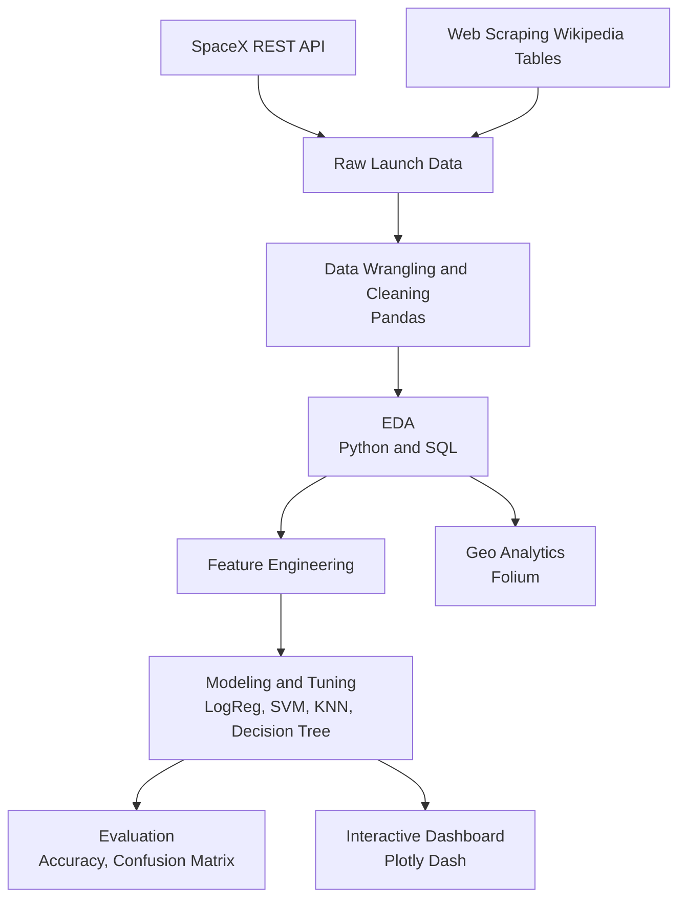

# SpaceX Falcon 9 Landing Prediction - End-to-End ML & Data Science Capstone
**IBM Data Science Professional Certificate | Capstone Project**

<p align="center">
  
</p>

<p align="center">
  <a href="https://github.com/adhishnanda/IBM-Data-Science-SpaceX-Capstone-Project"></a>
  
  
  
  
</p>

<p align="center">
  <b>Goal:</b> Predict whether SpaceX Falcon 9 first-stage landing will be successful using historical launch data + engineered features.<br/>
  <b>Deliverables:</b> Reproducible notebooks, ML models w/ tuning, interactive dashboard, and geo-analytics (Folium).
</p>

A complete **end-to-end data science capstone** (IBM Data Science Professional Certificate / Applied Data Science Capstone) using real SpaceX Falcon 9 launch data to **predict first-stage landing success** and derive insights that could help a hypothetical competitor (often framed as *SpaceY*) estimate launch cost drivers.

**What this repo shows (in one line):** data collection (**API + web scraping**), data wrangling, EDA (**Python + SQL**), geospatial analytics (**Folium**), model training (**scikit-learn**), and an interactive dashboard (**Plotly Dash**).

---

## 🔥 Why this project matters (ML Engineer lens)
SpaceX reuses the Falcon 9 first stage to reduce launch cost. Accurately predicting landing success can inform:
- mission planning & risk assessment
- cost estimation for competitors
- operational insights (site, payload, orbit impact)

This repo demonstrates an **end-to-end applied ML workflow**:
data acquisition → cleaning/wrangling → EDA (Python + SQL) → feature engineering → model training/tuning → evaluation → interactive visualization.

---

## 📌 Quick Links
- **📊 Dashboard:** `dashboard/` (Plotly Dash)
- **🧭 Folium Geo-Analytics:** `notebooks/Interactive Visual Analytics with Folium.ipynb`
- **🧠 ML Modeling:** `notebooks/Machine Learning Prediction.ipynb`
- **🎤 Final Slides (PDF):** `docs/final_presentation.pdf`

---

## 🧱 System Architecture (End-to-End)


---

## Highlights

- **Data collection**
  - SpaceX REST API ingestion (`requests`, `pandas`)
  - Wikipedia table scraping (`BeautifulSoup`)
- **Data wrangling & feature engineering**
  - Cleaning, label creation, one-hot encoding, train/test split
- **EDA**
  - Python EDA (Pandas/Matplotlib)
  - SQL EDA using DB2 via `ipython-sql` + `ibm_db_sa` *(optional)*
- **Interactive visual analytics**
  - Geospatial launch-site analysis with **Folium**
  - **Plotly Dash** dashboard for launch-site success rate & payload relationships
- **Machine learning**
  - Baseline and tuned classifiers with `GridSearchCV`:
    **Logistic Regression, SVM, KNN, Decision Tree**

---

## Repository Structure

```bash
spacex-falcon9-landing-prediction/
├── README.md
├── data/
│   ├── raw/
│   │   ├── spacex_launch_dash.csv   # used by Dash
│   └── processed/
├── notebooks/
│   ├── 01_data_collection_api.ipynb
│   ├── 02_data_collection_web_scraping.ipynb
│   ├── 03_data_wrangling.ipynb
│   ├── 04_eda_python.ipynb
│   ├── 05_eda_sql.ipynb
│   ├── 06_folium_geo_analytics.ipynb
│   └── 07_ml_prediction.ipynb
├── dashboard/
│   └── Dashboard.py
├── docs/
│   └── final_presentation.pdf
├── assets/
│   ├── images/
│   │   ├── banner.png
│   │   ├── dash_overview.png
│   │   ├── folium_map.png
│   │   ├── confusion_matrix.png
│   │   └── roc_curve.png
│   └── diagrams/
│       └── pipeline_flow.svg
├── requirements.txt
└── LICENSE
```

## Repository contents

| File / Notebook | Purpose |
|---|---|
| `Data Collection using API.ipynb` | Pull launch data from SpaceX API and create dataset |
| `Data Collection with Web Scraping.ipynb` | Scrape Wikipedia tables for launch-related information |
| `Data Wrangling.ipynb` | Clean data, create labels, prepare ML-ready dataset |
| `Exploratory Analysis Using Pandas and Matplotlib.ipynb` | EDA using Python charts & summary statistics |
| `Exploratory Analysis using SQL.ipynb` | EDA via SQL (DB2 connection required) |
| `Interactive Visual Analytics with Folium.ipynb` | Launch-site maps + proximity analysis |
| `Machine Learning Prediction.ipynb` | Train/tune models + evaluate performance |
| `Dashboard.py` | Plotly Dash app for interactive analytics |
| `spacex_launch_dash.csv` | Local snapshot (note: course also uses hosted datasets) |

---

## 🧪 Data Sources

This project integrates multiple real-world data acquisition methods to construct a machine-learning-ready dataset.

**Primary Sources:**

- **SpaceX REST API**
  - Collected historical Falcon 9 launch data using `requests`
  - Structured and converted JSON responses into Pandas DataFrames

- **Web Scraping (Wikipedia)**
  - Extracted supplemental launch information using `BeautifulSoup`
  - Parsed HTML tables and cleaned extracted features

- **IBM Skills Network Dataset**
  - Provided additional curated launch datasets for modeling and dashboard visualization

These combined sources enabled construction of a comprehensive feature set for predictive modeling.

---

## 🧹 Data Processing & Feature Engineering

Significant preprocessing was performed to transform raw data into a machine-learning-ready format.

**Key steps included:**

- Schema normalization and datatype conversion
- Handling missing values and inconsistent records
- Encoding categorical features
- Feature extraction from launch metadata
- Construction of target variable (landing success)
- Creation of clean training and testing datasets

These steps ensured robust model training and reproducibility.

---

## 🔍 Exploratory Data Analysis (EDA)

EDA was conducted using both Python and SQL to uncover patterns and relationships affecting landing success.

---

### Python-based Analysis (Pandas, Matplotlib, Seaborn)

Key insights explored:

- Payload mass vs landing success
- Launch site performance comparison
- Orbit type impact on landing outcome
- Landing success trends over time

<p align="center">
  
  
</p>

---

### SQL-based Analysis (IBM DB2 via ipython-sql)

SQL queries were used to validate and deepen analytical insights:

- Success rate grouped by orbit type
- Launch site success comparison
- Payload mass distribution analysis
- Aggregated landing outcome statistics

SQL analysis complemented Python-based exploration.

---

## 🧭 Geo-Spatial Analytics (Folium)

Interactive geospatial analysis was performed to visualize launch locations and landing outcomes.

<p align="center">
  
</p>

**Key insights:**

- All launch sites located near coastlines
- Sites optimized for landing safety and logistics
- KSC LC-39A demonstrated highest launch success rate

This confirms operational advantages of specific launch locations.

---

## 🤖 Machine Learning Pipeline

This is a **binary classification problem**:

**Goal:** Predict Falcon 9 first-stage landing success.

---

### Models Implemented

Four supervised machine learning algorithms were trained and evaluated:

- Logistic Regression
- Support Vector Machine (SVM)
- K-Nearest Neighbors (KNN)
- Decision Tree Classifier

---

### Hyperparameter Optimization

Hyperparameter tuning performed using:

- `GridSearchCV`
- Cross-validation

Ensured optimal model performance and reduced overfitting.

---

## 📈 Model Performance Results

| Model | Tuning | Test Accuracy | Notes |
|------|--------|--------------|------|
| Logistic Regression | GridSearchCV | 83.33% | Strong linear baseline |
| Support Vector Machine | GridSearchCV | 83.33% | Effective margin classifier |
| K-Nearest Neighbors | GridSearchCV | 83.33% | Non-parametric method |
| **Decision Tree** | GridSearchCV | **83.33%** | **Best model — interpretable and robust** |

The Decision Tree model was selected as the final model.

---

## 📊 Model Evaluation

<p align="center">
  
  
</p>

**Evaluation insights:**

- High overall classification accuracy
- Strong ability to predict successful landings
- Minor false positive predictions observed

Demonstrates effectiveness of feature engineering and model tuning.

---

## 📊 Interactive Dashboard (Plotly Dash)

A fully interactive dashboard was developed to visualize mission performance and landing success.

<p align="center">
  
</p>

**Dashboard features:**

- Launch site success analysis
- Payload vs landing outcome visualization
- Interactive filters
- Dynamic mission exploration

Provides real-time exploration of model insights.

---

## 🧠 Key Technical Skills Demonstrated

### Machine Learning Engineering

- Supervised classification modeling
- Feature engineering
- Hyperparameter tuning
- Model evaluation and selection

### Data Engineering Fundamentals

- REST API ingestion
- Web scraping pipelines
- Data cleaning and transformation

### Data Science & Analytics

- Exploratory Data Analysis
- SQL analytics
- Statistical visualization

### Data Visualization & Applications

- Interactive dashboards (Plotly Dash)
- Geospatial analysis (Folium)

---

## Quickstart (recommended)

### 1) Create environment

```bash
python -m venv .venv
# Windows: .venv\Scripts\activate
source .venv/bin/activate

pip install -U pip
pip install pandas numpy requests beautifulsoup4 lxml matplotlib seaborn scikit-learn folium dash plotly wget sqlalchemy ibm-db ibm-db-sa ipython-sql
```

> If you don’t want SQL/DB2, you can skip installing `ibm-db*` and `ipython-sql`.

### 2) Run notebooks

Open Jupyter and run notebooks in this order:

1. `Data Collection using API.ipynb`
2. `Data Collection with Web Scraping.ipynb`
3. `Data Wrangling.ipynb`
4. `Exploratory Analysis Using Pandas and Matplotlib.ipynb`
5. `Interactive Visual Analytics with Folium.ipynb`
6. `Machine Learning Prediction.ipynb`

*(Optional)* `Exploratory Analysis using SQL.ipynb` requires a DB2 connection string.

---

## Run the Dash dashboard (optional)

Your `Dashboard.py` expects a file named `spacex_launch_dash.csv`.

If you don’t have it locally, download the course dataset:

```bash
wget "https://cf-courses-data.s3.us.cloud-object-storage.appdomain.cloud/IBM-DS0321EN-SkillsNetwork/datasets/spacex_launch_dash.csv"
```

Then run:

```bash
python Dashboard.py
```

Open the URL printed in your terminal (typically `http://127.0.0.1:8050/`).

---

## Skills & tools demonstrated

**Python:** pandas, numpy, requests, BeautifulSoup, matplotlib, seaborn  
**SQL:** DB2 + ipython-sql + ibm_db_sa (optional)  
**Visualization:** folium (maps), plotly + dash (interactive dashboard)  
**ML:** scikit-learn classifiers, one-hot encoding, train/test split, GridSearchCV, evaluation metrics  
**Workflow:** notebook-based experimentation + reproducible steps, presentation/reporting

---

## Notes on data sources

This project mixes:
- locally included `spacex_launch_dash.csv`, and
- IBM Skills Network hosted datasets used throughout the original capstone labs.

If you want the exact same datasets as the course, follow the download links inside the notebooks.

---

# 🏁 Summary

This project demonstrates a complete end-to-end machine learning pipeline:

**Data acquisition → preprocessing → analysis → modeling → evaluation → visualization**

Final model achieved:

# ⭐ 83.33% accuracy predicting Falcon 9 landing success

---
